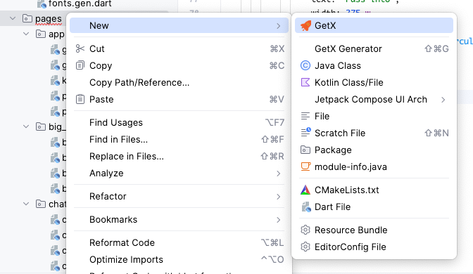

# Get Route Generator.

We can generate code like:

```dart
import 'package:get/get.dart';
import 'package:xxxx/pages/welcome_page/welcome_view.dart';
import 'package:xxxx/pages/welcome_page/welcome_binding.dart';
import 'package:xxxx/pages/login/login_view.dart';
import 'package:xxxx/pages/login/login_binding.dart';

class AppRouterName {
  static const String welcomePage = '/welcomePage';
  static const String loginPage = '/loginPage';
}

class AppRouter {
  static List<GetPage> pages = [
    GetPage(name: AppRouterName.welcomePage,
        page: () => const WelcomePage(),
        binding: WelcomeBinding()),
    GetPage(name: AppRouterName.loginPage, page: () => const LoginPage(), binding: LoginBinding()),
  ];
}
```

Only `@GetGeneratePage()` like:

```dart
@GetGeneratePage()
class WelcomePage extends StatelessWidget {
  const WelcomePage({super.key});

  @override
  Widget build(BuildContext context) {
    final logic = Get.find<WelcomeLogic>();
    final state = Get
        .find<WelcomeLogic>()
        .state;

    return Container();
  }
}
```

When project file structure like:

```
[welcome_page]
    [welcome_binding.dart]
    [welcome_logic.dart]
    [welcome_state.dart]
    [welcome_view.dart]
```

# Create new page with GetX in android studio.

step1


step2
